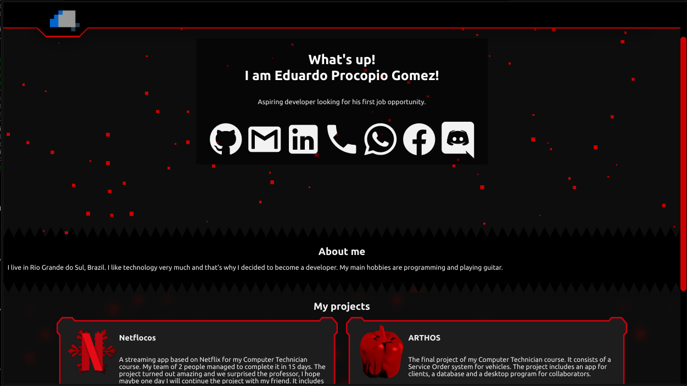

# portfolio

A gaming-looking portfolio.

## License Aggreement
EXHIBIT A. Common Public Attribution License Version 1.0.

“The contents of this file are subject to the Common Public Attribution
License Version 1.0 (the “License”); you may not use this file except in
compliance with the License. You may obtain a copy of the License at
https://github.com/EduApps-CDG/portfolio/raw/master/LICENSE.
The License is based on the Mozilla Public License Version 1.1
but Sections 14 and 15 have been added to cover use of software over a
computer network and provide for limited attribution for the Original
Developer. In addition, Exhibit A has been modified to be consistent with
Exhibit B.

Software distributed under the License is distributed on an “AS IS” basis,
WITHOUT WARRANTY OF ANY KIND, either express or implied. See the License for
the specific language governing rights and limitations under the License.

The Original Code is https://github.com/EduApps-CDG/portfolio.

The Original Developer is not the Initial Developer and is `__________`. If left
blank, the Original Developer is the Initial Developer.

The Initial Developer of the Original Code is Eduardo Procopio Gomez. All portions of
the code written by Eduardo Procopio Gomez are Copyright (c) 2022. All Rights Reserved.

Contributor `______________________`.

Alternatively, the contents of this file may be used under the terms of the
`_____` license (the `[___]` License), in which case the provisions of `[______]`
License are applicable instead of those above.

If you wish to allow use of your version of this file only under the terms of
the `[____]` License and not to allow others to use your version of this file
under the CPAL, indicate your decision by deleting the provisions above and
replace them with the notice and other provisions required by the `[___]`
License. If you do not delete the provisions above, a recipient may use your
version of this file under either the CPAL or the `[___]` License.”

`[NOTE: The text of this Exhibit A may differ slightly from the text of the
notices in the Source Code files of the Original Code. You should use the text
of this Exhibit A rather than the text found in the Original Code Source Code
for Your Modifications.]`

EXHIBIT B. Attribution Information

Attribution Copyright Notice: © 2022 Eduardo Procopio Gomez

Attribution Phrase (not exceeding 10 words): The Original Developer of this project is Eduardo Procopio Gomez.

Attribution URL: https://eduardo.ix.tc

Graphic Image as provided in the Covered Code, if any.

Display of Attribution Information is required in Larger Works
which are defined in the CPAL as a work which combines Covered Code or
portions thereof with code not governed by the terms of the CPAL.
